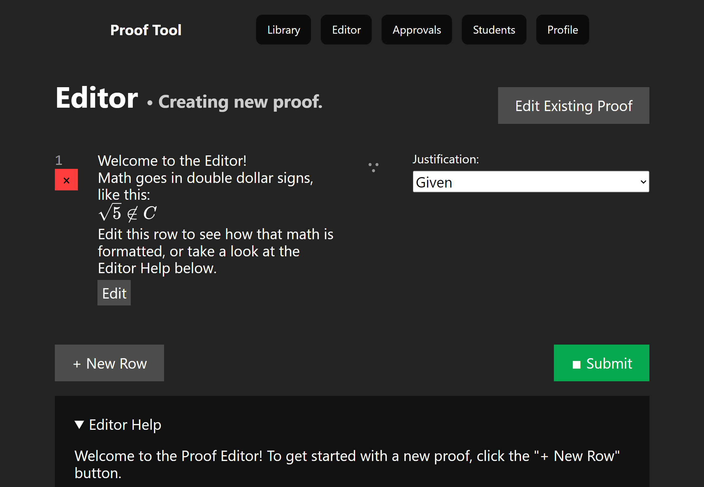

# proof-tool

A crowdsourced study tool for making and solving proof-based problems.

Proof Tool is a project made with Professor McCarty for University of Illinois Chicago's CS 151: Mathematical Foundations of Computing class.

This project was built with Next.js using NextAuth for authenticating users and MongoDB for the database.



## Project Setup

This project depends on having a MongoDB database ready along with a Google OAuth client application.

To get a new Google OAuth client application for this project, go to the [Google Cloud Console](https://console.cloud.google.com/) and click the project dropdown at the top left of the site's navigation bar.

In the popup window, click "New Project" at the top right.
Now click the menu icon at the top left to bring up a list of services the Google Cloud Platform provides. Go to "API & Services" > "Credentials."
Click "Create Credentials" if you do not already have an OAuth 2.0 Client listed.

Once you have an OAuth client, edit it and add the appropriate domains and URLs to your list of authorized Javascript origins and Redirect URIs.
By default, the Next.js dev server uses `http://localhost:3000` for local development. NextAuth by default uses `http://localhost:3000/api/auth/callback/google` to capture authentication information.

Take note of the Client ID and Secret on the right side. You'll need these next.

Rename the `.env.example` file to `.env` and fill in the approriate values. The MongoDB URI needs to include the database name you're using.

Now that the project is correctly configured, run the development server to see the project locally:

```bash
npm run dev
```

Open [http://localhost:3000](http://localhost:3000) with your browser to see the result.

You can start editing the page by modifying `pages/index.js`. The page auto-updates as you edit the file.

This is a [Next.js](https://nextjs.org/) project bootstrapped with [`create-next-app`](https://github.com/vercel/next.js/tree/canary/packages/create-next-app). To learn more about Next.js, take a look at the following resources:

- [Next.js Documentation](https://nextjs.org/docs) - learn about Next.js features and API.
- [Learn Next.js](https://nextjs.org/learn) - an interactive Next.js tutorial.
